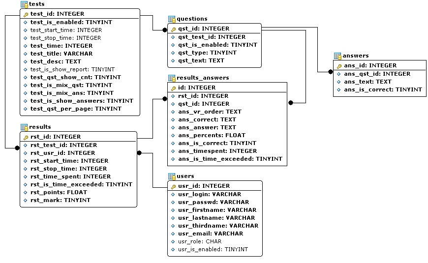

# Database

Originally MySQL 5.0 with MyISAM, now MariaDB 11.1 with InnoDB. No foreign key constraints defined.
Application code does not use transactions. Cascade deletes in application code.

## ER Diagram

## Tables

### users

| Column | Type | Notes |
|--------|------|-------|
| usr_id | int unsigned PK AI | |
| usr_login | varchar(32) UNIQUE | |
| usr_passwd | varchar(32) | MD5 hash |
| usr_firstname | varchar(64) | |
| usr_lastname | varchar(64) | |
| usr_thirdname | varchar(64) | Patronymic |
| usr_email | varchar(255) | Shown in user management list |
| usr_role | char(1) | `a` admin, `e` educator, `u` student. Default `u` |
| usr_is_enabled | tinyint(1) | Default 1. In schema, no UI |

### tests

| Column | Type | Notes |
|--------|------|-------|
| test_id | int unsigned PK AI | |
| test_is_enabled | tinyint(1) | 0 = draft, 1 = published |
| test_start_time | int unsigned | Availability start (unix ts) |
| test_stop_time | int unsigned | Availability end (unix ts) |
| test_time | int unsigned | Time limit in seconds (UI shows minutes). 0 = unlimited |
| test_title | varchar(255) | |
| test_desc | text | |
| test_is_show_report | tinyint(1) | Default 1. Not used in app |
| test_qst_show_cnt | tinyint(3) | Questions to show. 0 = all, N = random N. Default 15 |
| test_is_mix_qst | tinyint(1) | Shuffle questions. Default 1 (on) |
| test_is_mix_ans | tinyint(1) | Shuffle answers |
| test_is_show_answers | tinyint(1) | Reveal correct answers after |
| test_qst_per_page | tinyint(3) | 0 = one per page, 1 = all |

### questions

| Column | Type | Notes |
|--------|------|-------|
| qst_id | int unsigned PK AI | |
| qst_test_id | int unsigned | FK → tests |
| qst_is_enabled | tinyint(1) | Default 1 |
| qst_type | tinyint(3) | 1–5, see below |
| qst_text | text | |

Index on `qst_test_id`.

### answers

| Column | Type | Notes |
|--------|------|-------|
| ans_id | int unsigned PK AI | |
| ans_qst_id | int unsigned | FK → questions |
| ans_text | text | |
| ans_is_correct | tinyint(1) | Meaning depends on question type |

Index on `ans_qst_id`.

**`ans_is_correct` encoding by question type:**

| Type | Meaning of `ans_is_correct` |
|------|-----------------------------|
| 1 (free text) | 0 = wrong, 1 = correct |
| 2 (ordering) | Position number (1, 2, 3…) |
| 3 (single choice) | 0 = wrong, 1 = correct |
| 4 (multiple selection) | 0 = wrong, 1 = correct |
| 5 (ranking) | Rank number (1, 2, 3…) |

### results

| Column | Type | Notes |
|--------|------|-------|
| rst_id | int unsigned PK AI | |
| rst_test_id | int unsigned | FK → tests |
| rst_usr_id | int unsigned | FK → users |
| rst_start_time | int unsigned | Unix timestamp |
| rst_stop_time | int unsigned | 0 = in progress |
| rst_time_spent | int unsigned | Seconds |
| rst_is_time_exceeded | tinyint(1) | Auto-finished by timer |
| rst_points | float unsigned | 0–100 |
| rst_mark | tinyint(3) | Grade 1–5 |

Indexes on `rst_test_id`, `rst_usr_id`.

### results_answers

| Column | Type | Notes |
|--------|------|-------|
| id | int unsigned PK AI | |
| rst_id | int unsigned | FK → results |
| qst_id | int unsigned | FK → questions |
| ans_vr_order | text | CSV: answer display order |
| ans_correct | text | CSV: correct answer indices |
| ans_answer | text | CSV: student's answer indices |
| ans_percents | float unsigned | 0–100 |
| ans_is_correct | tinyint(1) | 0 = wrong, 1 = correct, 2 = partial |
| ans_timespent | int unsigned | Seconds |
| ans_is_time_exceeded | tinyint(1) | |

Indexes on `rst_id`, `qst_id`.

## Scoring

Per-question score stored in `results_answers.ans_percents`.
Total score in `results.rst_points` = average of per-question percentages.

### Grade Scale

| Score | Grade |
|-------|-------|
| 90–100% | 5 (excellent) |
| 70–89% | 4 (good) |
| 50–69% | 3 (satisfactory) |
| 40–49% | 2 (unsatisfactory) |
| 0–39% | 1 (fail) |
