# Use Cases

## Authentication

1. Submit login + password
2. DB lookup, MD5 comparison
3. Success: session created, redirect by role
4. Failure: login form with error

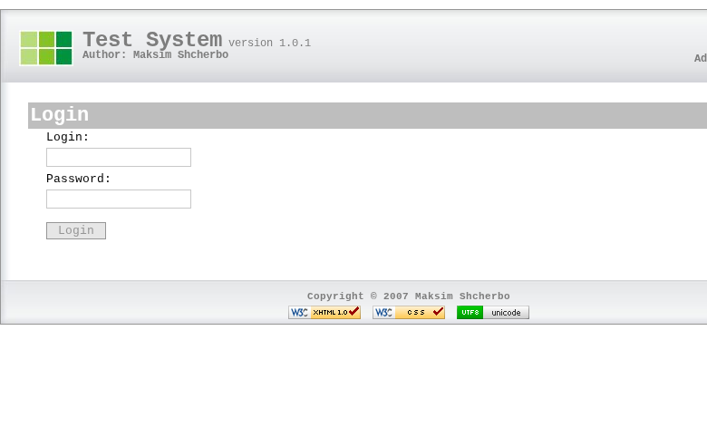

No authorization middleware. Module-level checks only: tests module requires identity, admin module requires identity + role.

---

## Admin

### Manage Users

1. Browse paginated user list
2. Create user: login, password, name, role
3. Edit user
4. Delete user (hard delete, with confirmation)

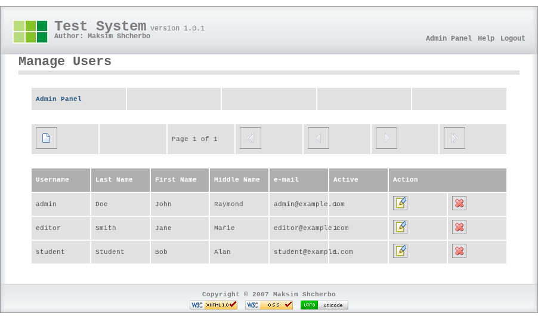

Admins have all teacher capabilities plus user management.

---

## Teacher

### Create a Test

1. Open admin panel
2. Create test:
   - Title, description
   - Time limit (minutes in UI, stored as seconds in DB; 0 = unlimited)
   - Availability window (start/stop timestamps)
   - Questions to show (0 = all, N = random selection of N)
   - Shuffle questions, shuffle answers (flags)
   - Show correct answers after completion (flag)
   - Display mode: one per page / all per page
3. Add questions — select type, enter text, enter answer variants with correct marking
4. Enable test
5. Test becomes visible to students when within availability window

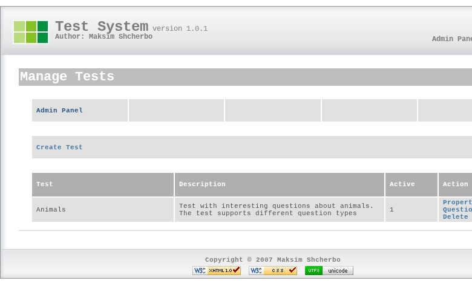

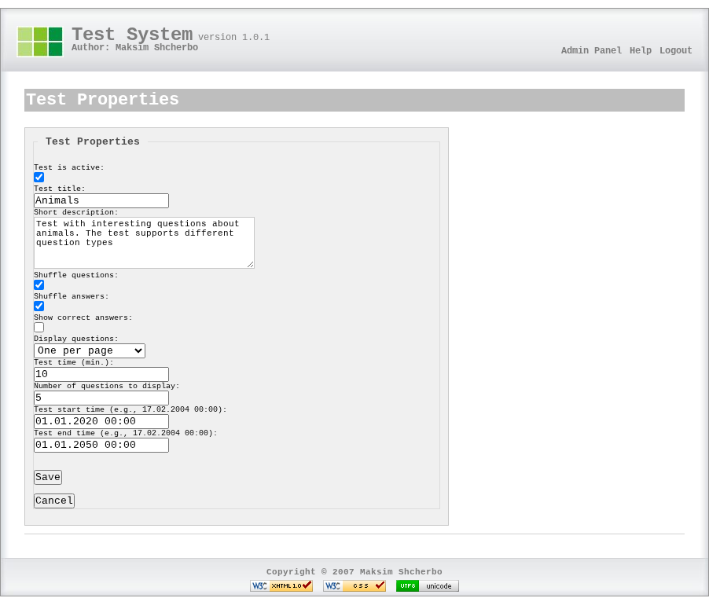

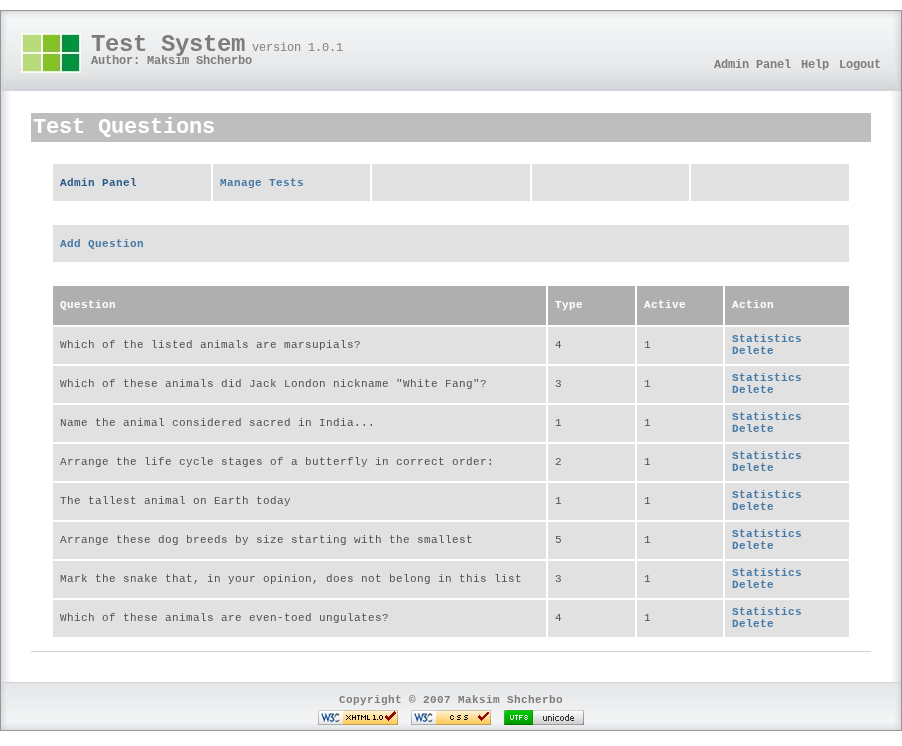

### Question Types

| Type | Name | Input | Scoring |
|------|------|-------|---------|
| 1 | Free text | Textarea | All or nothing (exact match, case-sensitive, trimmed) |
| 2 | Ordering | Position dropdowns | All or nothing |
| 3 | Single choice | Radio buttons | All or nothing |
| 4 | Multiple selection | Checkboxes | Partial credit: 100%/N per correct pick; any wrong pick = 0% |
| 5 | Ranking | Priority dropdowns | All or nothing |

### Analyse Question Effectiveness

Per-question statistics across all submissions:

- Number of respondents
- Average score
- Per-variant breakdown: times selected, percentage
- Correctness summary: correct / incorrect / partial (counts + %)

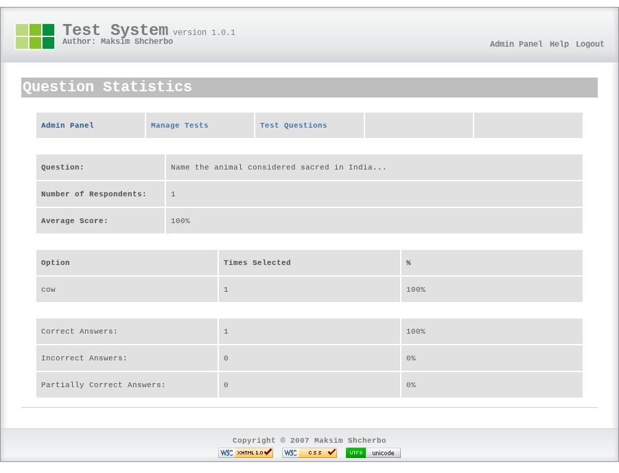

Computed on the fly from raw data. No pre-aggregated tables. Per-question only — no test-level aggregate statistics.

### View Reports

1. Browse results across all tests
2. Filter by test — per student: name, score, grade, time, time-exceeded flag
3. Drill into a result — per question: text, student answer, correct answer, score
4. Delete a result (hard delete, with confirmation)

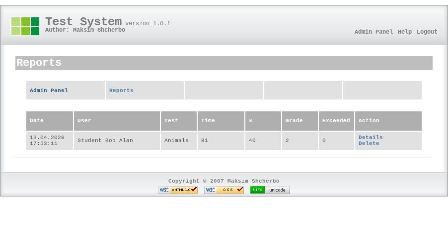

---

## Student

### Take a Test

1. Browse active tests (enabled, within availability window)
2. Start test — system creates a result record, selects and optionally shuffles questions
3. Answer questions:
   - **One-per-page**: submit answer, see next
   - **All-on-page**: answer everything, submit once
4. View results — score (%) and grade (1–5)
5. Review answers (if enabled) — per question: your answer vs correct answer

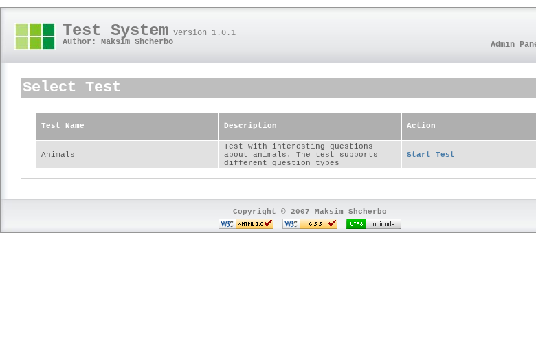

#### One-per-page mode

Each question shown individually.

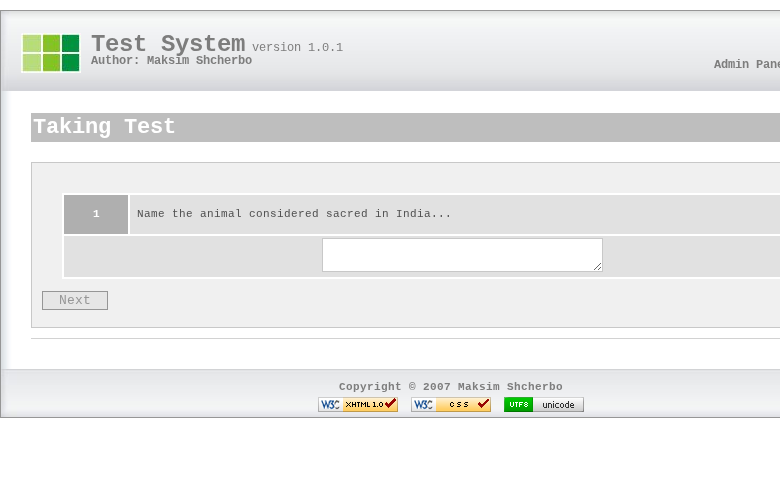

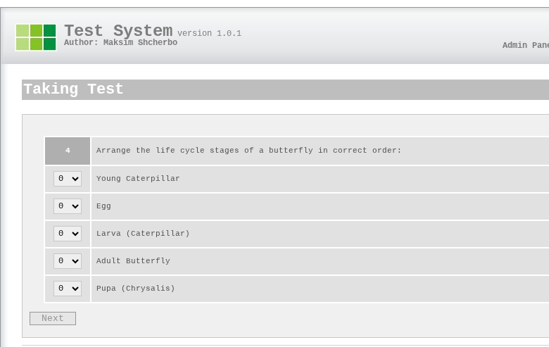

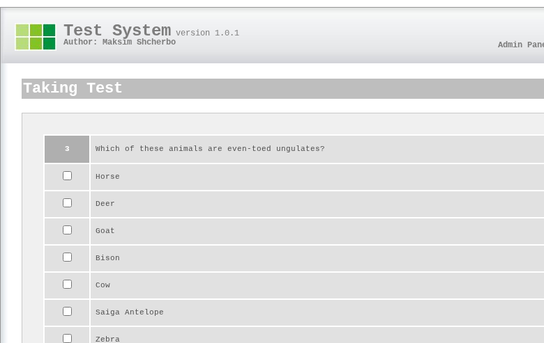

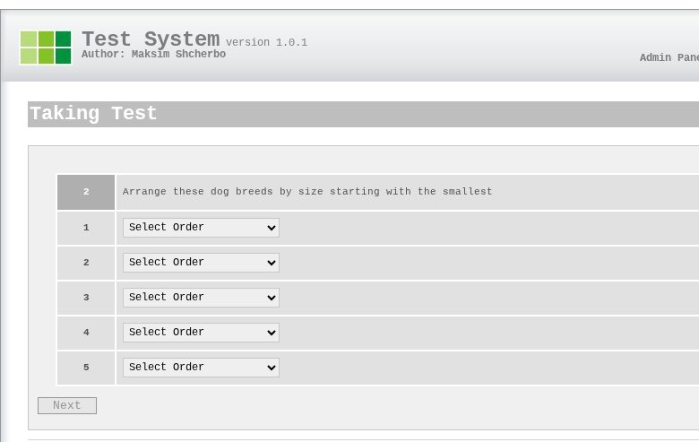

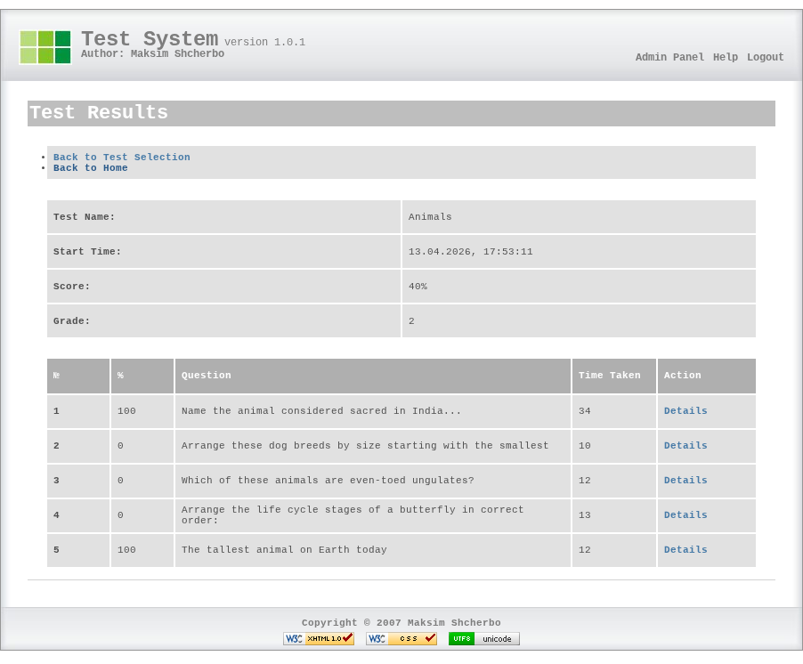

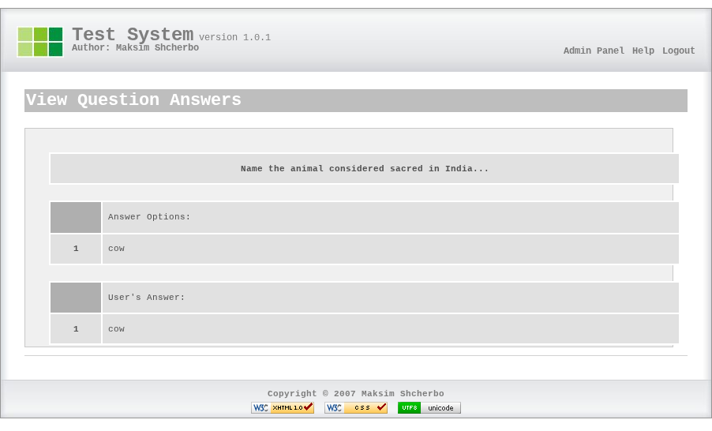

#### All-on-page mode

All questions on a single page with a countdown timer. Submitted at once.

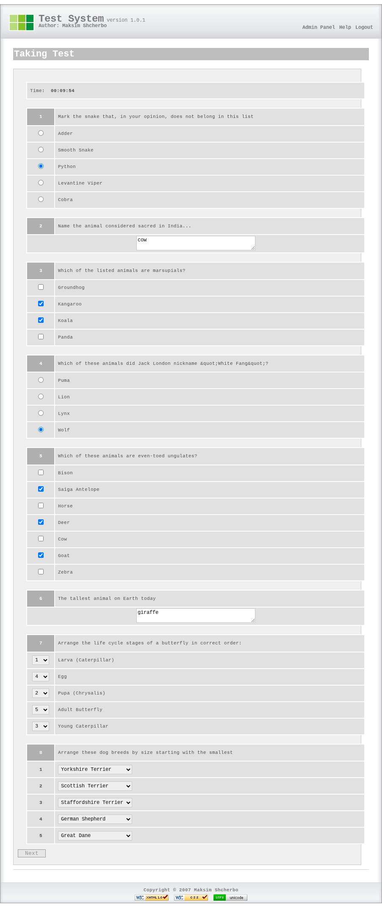

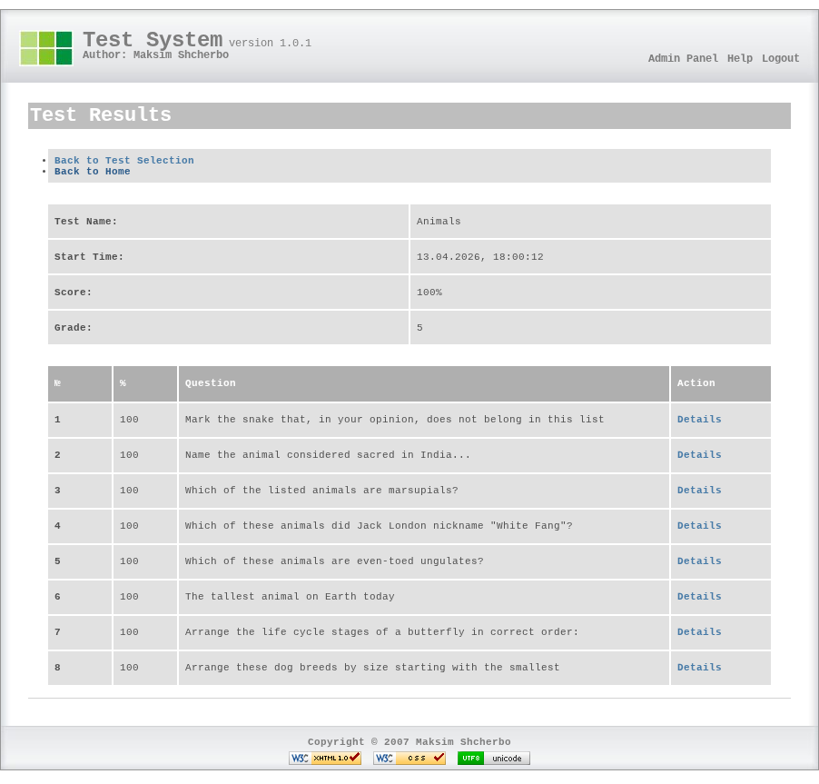

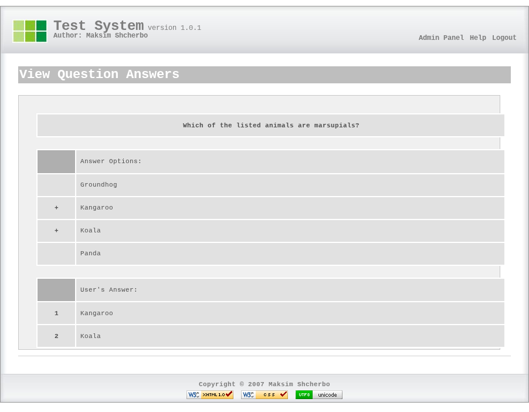

**Timer**: if a time limit is set, the system checks elapsed time on each submission. Exceeding the limit auto-finishes the test. In all-on-page mode, a countdown timer is visible at the top. In one-per-page mode, enforcement is server-side only — no visible timer.

**Per-question timing**: tracked only in one-per-page mode (results show "Time Taken" column). All-on-page mode has no per-question timing.

**Session loss**: test state lives in PHP session. Session expiry = lost progress, no recovery. In practice never an issue — tests are short enough to complete within session lifetime.
